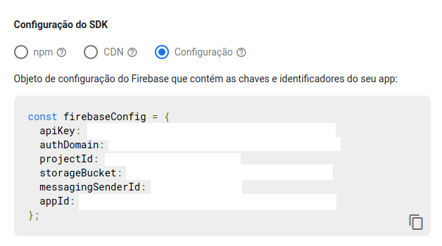

# Snapchat Clone

React.js and Redux project by [**Sonny Sangha**](https://www.youtube.com/channel/UCqeTj_QAnNlmt7FwzNwHZnA) on YouTube.

This is a learning project to improve React.js and Redux knowledge.

YouTube Video: [🔴 Let's build SNAPCHAT with REACT.JS! (with Camera, REDUX & Firebase)](https://youtu.be/1kGISk5ft2w)

## How to configurate Firebase

There is a [template](.env.template) of the environment file on root path.

First, you need to get your firebase project credentials inside the app settings.

After this, create a file named `.env.local` and replace the object data on its respective environment variable, according to the template.
